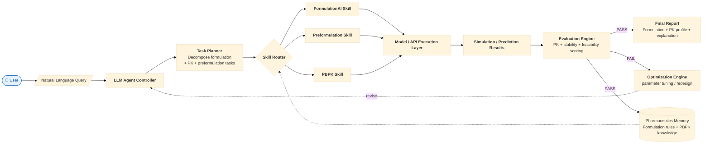
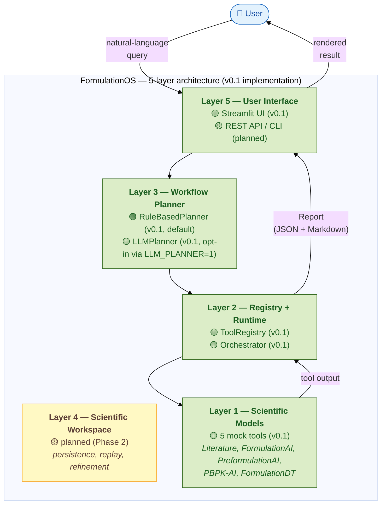

# FormulationOS

**A Scientific Operating System for Agentic Computational Pharmaceutics**

[](https://www.python.org/)
[](#engineering-reference)
[](#6-current-prototype)
[](LICENSE)

FormulationOS is an operating layer that orchestrates heterogeneous
scientific AI models through natural language. It introduces the
**Scientific Workflow Abstraction** — a first-class abstraction that
unifies execution, persistence, replay, refinement, provenance, and
artifacts under a unified operating layer. In the current
implementation, Scientific Workflows are expressed as directed acyclic
execution graphs (DAGs).

This README is structured for research positioning first (§1–§5),
then implementation status (§6–§9), then concrete next-step tasks
(§10). Engineering how-to is at the end.

---

## 1. Motivation

Modern computational pharmaceutics has produced increasingly powerful
AI models for individual scientific tasks — formulation recommendation,
solubility prediction, stability assessment, PK/PD simulation, molecular
property prediction. However, these models usually operate as
**isolated scientific components**.

A real formulation development workflow is not a single prediction
task. It requires a sequence of interconnected decisions:

```
Drug candidate
        ↓
Preformulation characterization
        ↓
Formulation strategy selection
        ↓
Performance prediction
        ↓
Optimization and refinement
```

Existing AI systems typically optimize individual modules, while
scientists must manually connect heterogeneous tools, interpret
outputs, and make iterative decisions.

FormulationOS explores a different paradigm:

> Instead of building another isolated prediction model, we investigate
> a **scientific operating layer** that enables AI agents to discover,
> execute, evaluate, and combine existing computational pharmaceutics
> capabilities.

---

## 2. Research Vision

The long-term goal of FormulationOS is to develop an **agentic
scientific workflow framework** for computational pharmaceutics. The
target architecture combines an LLM-based controller with a
domain-specialized skill registry, an evaluation engine, an
optimization loop, and a persistent pharmaceutics memory.

```
Natural Language Scientific Query
                ↓
        LLM Scientific Agent
                ↓
        Task Decomposition
                ↓
        Scientific Tool Selection
                ↓
        Model / API Execution
                ↓
        Scientific Evaluation
                ↓
        Formulation Recommendation
```

The core research question:

> How can heterogeneous pharmaceutical AI models be transformed into
> interoperable scientific skills that can collaboratively solve complex
> formulation problems?

### Research-vision architecture

The diagram below shows the **long-term target architecture** for
FormulationOS. It includes feedback loops (FAIL → Optimization Engine →
revise query) and a persistent memory (Pharmaceutics Memory) that
informs future routing. The **current implementation** (§7 Architecture)
implements only the linear top-half of this diagram.



**Legend.** 🟢 Live = implemented in v0.1. 🟡 Planned = research-vision
component, not yet built. The current v0.1 prototype implements the
linear top half (User → Query → Controller → Skills → Execution →
Report). The Optimization Engine and Pharmaceutics Memory are
research-vision targets (Route 2 / Route 3 in §4).

---

## 3. Existing Computational Pharmaceutics AI Landscape

Recent platforms demonstrate the potential of AI-assisted formulation
development.

| Platform | Main capability | Current role |
|---|---|---|
| **FormulationAI** | formulation strategy prediction, excipient selection across 6 formulation systems | formulation intelligence |
| **PreformulationAI** | solubility, permeability, stability-related prediction | physicochemical assessment |
| **FormulationMM** | molecular simulation and formulation structure analysis | mechanistic modeling |
| **FormulationDT** | decision-tree based formulation prediction and digital-twin style analysis | formulation decision support |
| **AI-PBPK** | pharmacokinetic simulation and exposure prediction | PK evaluation |

These systems each address **one stage** of the formulation pipeline.
Together, they cover the full pre-clinical formulation workflow —
from molecular characterization, through excipient design, to in-vivo
prediction. Yet each platform is currently a **standalone web service
with its own UI, data format, and access pattern**.

A missing layer remains:

> How can these independent AI systems collaborate within an
> end-to-end scientific workflow?

FormulationOS aims to explore this missing orchestration layer.

---

## 4. Research Directions

Based on current computational resources and scientific objectives,
we identify three possible development directions. They are
**not mutually exclusive** — later routes build on earlier ones.

### Route 1 — Single-Agent Scientific Workflow (current priority)

Inspired by scientific AI systems such as MDCrow, a single LLM-based
agent acts as a workflow coordinator.

```
User Query
        ↓
LLM Planner
        ↓
Scientific Tool Router
        ↓
   ---------------------
   |          |          |
FormAI   PreAI       PBPK
   ↓
Evaluation Engine
        ↓
Scientific Report
```

**Research focus:** task decomposition, scientific tool selection,
workflow execution, result synthesis.

**Advantages:**

- ✅ Compatible with existing platforms
- ✅ Fastest path to end-to-end prototype
- ✅ Low additional data requirement

This is the route the current v0.1 prototype implements.

### Route 2 — Multi-Agent Formulation Scientist System

Extend the single-agent workflow into a team of specialized scientific
agents.

```
Chief Scientist Agent
        |
--------------------------------
        |
Solubility Agent
Formulation Agent
PK Agent
Reviewer Agent
        |
Consensus Decision
```

**Potential research questions:**

- How should scientific agents communicate?
- How should conflicting predictions be resolved?
- Can agents reproduce expert formulation reasoning?

### Route 3 — Self-Evolving Formulation Research System

A long-term vision combining workflow memory, feedback loops, and
iterative optimization.

```
Prediction
        ↓
Evaluation
        ↓
Failure Analysis
        ↓
Strategy Revision
        ↓
New Formulation
```

The system gradually learns from previous formulation attempts and
improves future decision making.

---

## 5. Research Roadmap

The three routes above correspond to a long-term research roadmap.

| Phase | Focus | Implementation status |
|---|---|---|
| **Phase 1** | Single-Agent Scientific Workflow prototype (Route 1) | ✅ v0.1 prototype live |
| **Phase 2** | Multi-Agent Collaboration (Route 2) | ⏳ Future |
| **Phase 3** | Self-Improving Scientific System (Route 3) | ⏳ Long-term |

### Phase 1 — Scientific Workflow Prototype (current)

**Goal.** Build an agentic orchestration layer connecting existing AI
capabilities.

**Components:** LLM planner, scientific tool registry, execution
runtime, report generation.

### Phase 2 — Multi-Agent Collaboration (future extension)

**Goal.** Specialist formulation agents, scientific debate,
uncertainty analysis, consensus generation.

### Phase 3 — Self-Improving Scientific System (long-term)

**Goal.** Persistent scientific memory, experiment feedback,
iterative optimization, autonomous formulation design.

---

## 6. Current Prototype

FormulationOS v0.1 demonstrates the **operating layer** end-to-end with
mock scientific tools. It validates that Scientific Workflows,
planner routing, registry lookup, executor dispatch, and Report
rendering compose correctly — without claiming any real-model
prediction.

```
Planner
        ↓
Scientific Registry
        ↓
Workflow Orchestrator
        ↓
Scientific Report
        ↓
Streamlit Interface
```

**Status (v0.1):**

- ✅ 5-layer architecture implemented (Planner → Registry → Runtime
  → Report → Streamlit UI)
- ✅ DAG-based scientific workflow execution
- ✅ STS scientific tool abstraction (4 extensions, `extra="forbid"`)
- ✅ 151 tests passing on `main`
- ✅ LLM-based routing prototype (MiniMax M3 / OpenAI; opt-in via
  `LLM_PLANNER=1`)
- ✅ Streamlit demonstration interface

**Important boundary.** All 5 built-in scientific tools are
**mock-only** — placeholder outputs labelled `MOCK OUTPUT`. No real
scientific prediction is currently produced. Real-model integration is
the binding open question; see §9 for the current strategy and
`docs/research_notes/` for the active investigation.

> **Deterministic-evidence principle.** FormulationOS does not promise
> deterministic models. It promises deterministic evidence — every
> execution emits a reproducible tool-version + input-hash + output-hash
> + compute-environment record.

---

## 7. Architecture

The **current implementation** (v0.1) uses a 5-layer operational
architecture. The research-vision architecture (§2) extends this with
feedback loops and persistent memory.



**Substitutions.** The Planner slot accepts any
`formulation_os.planner.base.Planner` implementation: the rule-based
v0.1 default or the LLM-backed one (opt-in via `LLM_PLANNER=1`). The
Executor slot accepts any
`formulation_os.runtime.executor.Executor`; v0.1 ships the
`PythonExecutor`, with HTTP / CLI / MCP / gRPC / Docker planned.

**Code map.** See [`docs/architecture.md`](docs/architecture.md) for
the full diagram with component → code mapping.

---

## 8. Scientific Tool Specification (STS)

STS is the contract every Tool in FormulationOS must satisfy. A Tool
is declared via `tool.yaml` following the
[STS v0.2 specification](docs/sts_specification.md).

STS is an **extension schema** over standard tool specifications
(OpenAPI, MCP tool descriptors), adding four scientific extensions:

1. **Scientific Semantics** — informal capability annotations
2. **Planning Hints** — examples, keywords, notes for the Workflow Planner
3. **Scientific Dependencies** — cross-tool constraints
4. **Provenance Specification** — declarative trace requirements

Unknown fields are rejected (`extra="forbid"`): a Tool that declares
fields outside the STS schema cannot be guaranteed to interoperate.

To add a new Tool, see [`docs/tool_author_guide.md`](docs/tool_author_guide.md).

---

## 9. Current Integration Strategy

Existing AI platforms can be integrated through multiple mechanisms,
corresponding to the executor types reserved in STS v0.2.

### Python Model Wrapper (Adapter pattern)

For open-source models with importable code:

```
Python Model (e.g., NamanWang/FormulationDT, MIT)
        ↓
Scientific Executor (Adapter)
        ↓
STS Tool
```

The Adapter lazy-imports the upstream package and falls back to a
clear `model_unavailable` status if the package is not installed. No
fabricated predictions — see
[`docs/research_notes/formulation_dt_adapter.md`](docs/research_notes/formulation_dt_adapter.md).

### API / Service Executor (HTTP)

For deployed platforms with a programmatic surface:

```
Web Service / API (e.g., FormulationAI, PreformulationAI)
        ↓
HTTP Executor
        ↓
STS Tool
```

### Container / Subprocess Executor (Docker / CLI)

For compute-heavy simulation engines:

```
Docker Image / CLI Binary (e.g., GROMACS / Amber)
        ↓
Docker / CLI Executor
        ↓
STS Tool
```

The full integration strategy, with per-platform access verification
status, is in
[`docs/research_notes/scientific_model_integration_matrix.md`](docs/research_notes/scientific_model_integration_matrix.md).
A strategic decision document covering the open architectural questions
is in
[`docs/research_notes/phase2_integration_strategy.md`](docs/research_notes/phase2_integration_strategy.md).

---

## 10. Roadmap

The concrete next-step tasks behind the Phase 1 / Phase 2 / Phase 3
research roadmap (§5).

### Phase 1 — Real tool integration

- **FormulationDT adapter** — STS + Python Executor wrapper around
  the public `NamanWang/FormulationDT` repository. Adapter pathway
  ships immediately with `model_unavailable` semantics; full inference
  blocked on upstream API + weights.
- **FormulationAI connector** — HTTP executor against the
  `formulationai.computpharm.org` web service (assuming API access).
- **PreformulationAI connector** — same pattern as FormulationAI.
- **PBPK executor** — auth-gated HTTP executor against
  `aipbpk.computpharm.org`.

### Phase 2 — Agent reasoning

- Adaptive planning (re-plan when a Tool fails or returns
  `model_unavailable`).
- Tool comparison (route the same query to multiple Tools and pick
  by confidence / latency).
- Uncertainty reasoning (surface prediction confidence in Report).
- Embedding-based retriever (vector index over `Tool.to_card()`,
  replacing today's keyword-only matching).

### Phase 3 — Self-evolving formulation agent

- Persistent scientific memory (workspace-backed formulation rules
  and PBPK knowledge).
- Experiment feedback loop (record outcomes, surface in next
  prediction).
- Iterative optimization (refinement via multi-turn queries).
- Autonomous formulation design (Route 3 in §4).

---

## Engineering Reference

The following sections cover how to run and develop FormulationOS.
They are not part of the research positioning.

### Quickstart

```bash
git clone <repo-url> FormulationOS
cd FormulationOS
make install          # pip install -e ".[all,dev]"
```

```bash
make test              # 151 tests, ~2 seconds
```

```bash
make run-ui            # rule-based planner, no key required
# → opens http://localhost:8501 in your browser
```

**With the LLM planner** (MiniMax M3 by default):

```bash
export MINIMAX_API_KEY=***          # or ANTHROPIC_API_KEY
make run-ui-llm
# same UI, but routing is now done by the LLM
```

### Built-in Mock Tools

| Tool | Capability | Domain |
|------|-----------|--------|
| `FormulationAI` | excipient design | formulation |
| `PreformulationAI` | solubility / permeability / stability prediction | preformulation |
| `PBPK-AI` | PK parameter estimation | pbpk |
| `FormulationDT` | dissolution profile / particle simulation | digital-twin |
| `Literature` | literature search | literature |

All five are mocks (`mock: true`) that return deterministic placeholder
data with `warnings` fields clearly labeled.

### Development

```bash
make install    # editable install with [all,dev]
make test       # full pytest run
make lint       # ruff + mypy
make run-ui     # Streamlit (rule-based)
make run-ui-llm # Streamlit (LLM; needs MINIMAX_API_KEY or ANTHROPIC_API_KEY)
make clean      # remove caches and build artifacts
```

See [`CONTRIBUTING.md`](CONTRIBUTING.md) for the dev setup, code
style, commit-message convention, and how to add a new Tool or
Planner.

---

## License

MIT — see [LICENSE](LICENSE).