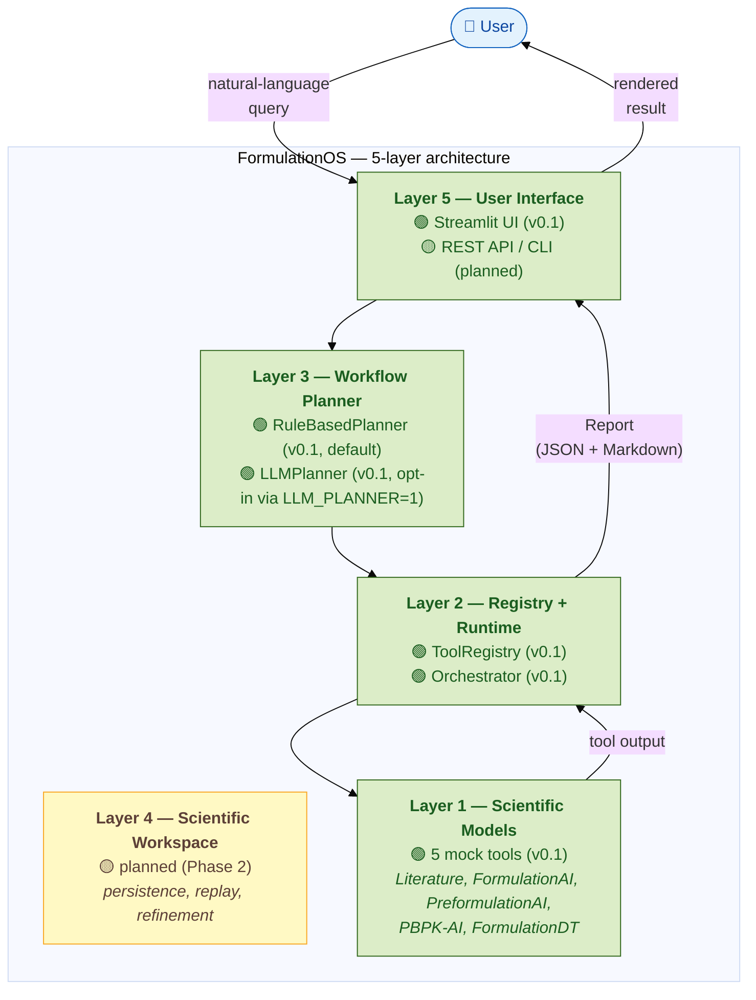

# FormulationOS Architecture

This document gives a one-page overview of FormulationOS's 5-layer
architecture and the data flow through it. For the full design, see
[`paper/sections/04_formulationos_architecture.md`](../paper/sections/04_formulationos_architecture.md).
For the scientific-tool contract every layer relies on, see
[`docs/sts_specification.md`](sts_specification.md).

---

## Figure 1 — 5-layer architecture and query flow

**Reading the figure.** A user issues a natural-language query from the
top. The query descends through the stack (UI → Planner → Registry →
Models), the chosen tool executes, and the result propagates back up
as a `Report` (JSON + Markdown) which the UI renders for the user.

**Status legend.** 🟢 = implemented in v0.1; 🟡 = planned for a later
phase. The Workspace (Layer 4) is orthogonal to the immediate query
path — it is reached only for persistence, replay, and refinement,
which arrive in Phase 2.

**Substitutions.** The Planner slot accepts any
:class:`formulation_os.planner.base.Planner` implementation: the
rule-based v0.1 default or the LLM-backed one (MiniMax M3, opt-in via
`LLM_PLANNER=1`). The Executor slot (inside the Orchestrator) accepts
any :class:`formulation_os.runtime.executor.Executor`; v0.1 ships the
`PythonExecutor`, with HTTP / CLI / MCP / gRPC / Docker planned.

---

## Component → code map

| Component | Module | Status |
|-----------|--------|--------|
| Streamlit UI | `src/formulation_os/ui/app.py` | v0.1 |
| RuleBasedPlanner | `src/formulation_os/planner/rule_based.py` | v0.1 |
| LLMPlanner | `src/formulation_os/planner/llm.py` | v0.1 |
| MiniMax / OpenAI clients | `src/formulation_os/llm/client.py` | v0.1 |
| ToolRegistry | `src/formulation_os/registry/registry.py` | v0.1 |
| Orchestrator | `src/formulation_os/orchestrator/orchestrator.py` | v0.1 |
| Report (data + Markdown) | `src/formulation_os/report/report.py` | v0.1 |
| Tool / ToolSpec / STS v0.2 | `src/formulation_os/core/tool.py` | v0.1 |
| Executor ABC + PythonExecutor | `src/formulation_os/runtime/executor.py` | v0.1 |
| Built-in mock tools | `src/formulation_os/tools/builtins/*/` | v0.1 |
| Scientific Workspace | `src/formulation_os/workspace/` | Phase 2 |
