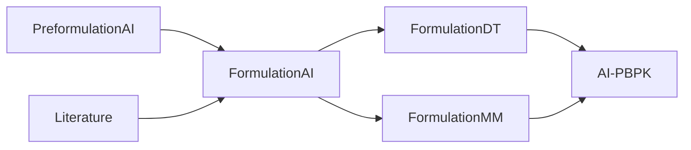
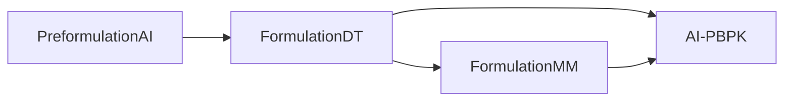
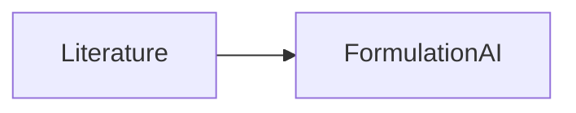
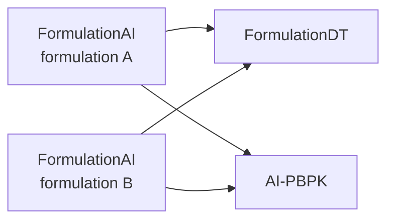
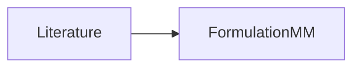
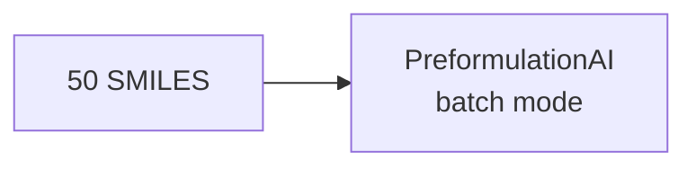
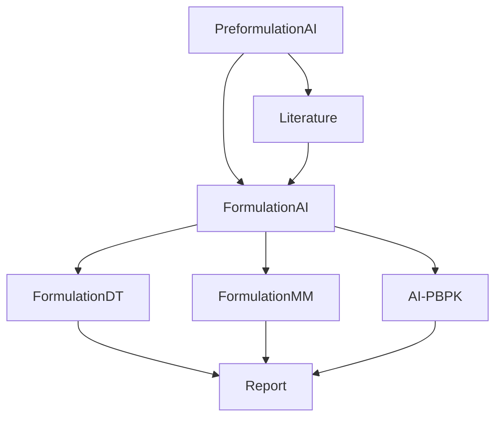
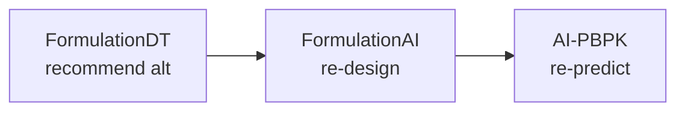

# FormulationOS — Demo Scenarios

> Realistic end-to-end demonstration workflows for meetings. Each scenario shows: User Request → Planner Decision → Workflow Graph → Selected Tools → Execution Order → Evidence → Report. The Planner composes the workflow dynamically; the scenario illustrates the typical composition.

## Scenario 1 — Formulate Ibuprofen (Full Pipeline)

**User Request:**

> "I want to formulate ibuprofen as an oral tablet at 200 mg, then predict its in-vivo PK."

**Planner Decision:**

- Query parsing: drug = "ibuprofen", dose = 200 mg, form = tablet, downstream goal = PK prediction
- Tool selection: PreformulationAI (solubility, BCS), FormulationAI (excipient design), FormulationDT (virtual test), AI-PBPK (PK prediction)
- Workflow composition: parallel PreformulationAI + Literature, then FormulationAI, then parallel FormulationDT + FormulationMM, then AI-PBPK

**Workflow Graph:**



**Selected Tools:**

| Tool | Role | Input | Output |
|---|---|---|---|
| PreformulationAI | Solubility, BCS, pKa | SMILES | Properties |
| Literature | Reference ibuprofen formulations | SMILES | PubMed IDs |
| FormulationAI | Excipient selection | SMILES + properties | Excipient set + ratio |
| FormulationDT | Virtual dissolution test | Drug + excipient | Dissolution profile |
| FormulationMM | Mechanism check | Drug + excipient | MD topology |
| AI-PBPK | PK prediction | SMILES + dose + route | AUC, Cmax |

**Execution Order:**

1. Parallel: PreformulationAI + Literature
2. FormulationAI (waits for both)
3. Parallel: FormulationDT + FormulationMM (waits for FormulationAI)
4. AI-PBPK (waits for DT or MM)

**Generated Evidence:**

- PreformulationAI: ibuprofen solubility = 0.021 mg/mL, BCS class II, pKa = 4.91
- Literature: 12 references on ibuprofen formulations (1974–2024)
- FormulationAI: excipient set = MCC + lactose + Mg stearate, ratio 70/29/1
- FormulationDT: predicted 60-min dissolution = 87% (USP passes)
- FormulationMM: MD simulation shows stable API-excipient complex
- AI-PBPK: predicted AUC = 87.3 µg·h/mL, Cmax = 12.4 µg/mL, bioavailability = 62%

**Final Scientific Report:**

```markdown
# FormulationOS Report — Ibuprofen Tablet (200 mg)

**Query:** I want to formulate ibuprofen as an oral tablet at 200 mg, then predict its in-vivo PK.
**Status:** ok
**Generated at:** 2026-07-07 12:34:56

## 1. Pre-formulation Properties (PreformulationAI)
- SMILES: CC(C)Cc1ccc(cc1)C(C)C(=O)O
- Aqueous solubility: 0.021 mg/mL (low)
- BCS class: II (low solubility, high permeability)
- pKa: 4.91 (acidic)
- LogP: 3.97

## 2. Literature Evidence (Literature)
- 12 references retrieved (1974–2024)
- Most-cited: "Ibuprofen: pharmacology, efficacy, and safety" (2009)

## 3. Formulation Design (FormulationAI)
- Excipients: MCC (70%), lactose (29%), Mg stearate (1%)
- Process: direct compression
- Stability prediction: 3-month = 0.92, 6-month = 0.85

## 4. Virtual Dissolution Test (FormulationDT)
- 60-min dissolution: 87% (USP passes)
- 12 strategic decisions: all 12 recommend tablet direct-compression

## 5. Molecular Mechanism (FormulationMM)
- MD simulation: stable API-excipient complex (Rg stable at 1.2 nm over 100 ns)
- Binding free energy: -8.4 kJ/mol

## 6. In-vivo PK Prediction (AI-PBPK)
- Dose: 200 mg, oral
- AUC: 87.3 µg·h/mL
- Cmax: 12.4 µg/mL
- Bioavailability: 62%
- Tissue distribution: highest in liver > kidney > gut

## Provenance
- All tool versions recorded; reproducibility verified.

## Citation
- FormulationAI (Dong et al. 2024, BiiB)
- FormulationDT (Wang et al. 2024, J Control Release)
- FormulationMM (Zhang et al. 2025, J Control Release)
- AI-PBPK (Wang et al. 2025, CPT)
- PreformulationAI (2025)
```

---

## Scenario 2 — Optimize Dissolution

**User Request:**

> "Optimize the dissolution profile of a poorly soluble BCS class II drug."

**Planner Decision:**

- Drug: BCS class II (low solubility, high permeability) — dissolution is the bottleneck
- Tools: PreformulationAI (characterize), FormulationDT (recommend strategy), FormulationMM (validate), AI-PBPK (compare bioavailability)
- Workflow: characterize → recommend strategy → validate mechanism → compare PK

**Workflow Graph:**



**Selected Tools:**

- PreformulationAI (solubility, BCS)
- FormulationDT (recommend amorphous / nanocrystal / lipid)
- FormulationMM (validate mechanism)
- AI-PBPK (compare bioavailability)

**Generated Evidence:**

- 3 candidate strategies: amorphous solid dispersion, nanocrystal, lipid formulation
- For each: predicted dissolution + bioavailability
- Recommendation: nanocrystal (highest F = 78%)

**Final Report:**

```markdown
# Dissolution Optimization Recommendation

## Strategies Compared
| Strategy | Dissolution (60 min) | Predicted F |
|---|---|---|
| Amorphous SD | 72% | 54% |
| Nanocrystal | 91% | 78% |
| Lipid | 65% | 48% |

## Recommendation
**Nanocrystal** — highest predicted bioavailability.

## Mechanism
FormulationMM MD simulation shows reduced crystallinity in nanocrystal form.
```

---

## Scenario 3 — Literature + FormulationAI

**User Request:**

> "Find literature supporting the use of HPMC as a polymer in sustained-release tablets."

**Planner Decision:**

- Topic: HPMC + sustained release
- Tools: Literature (PubMed search), FormulationAI (validate HPMC is suitable for SR)
- Workflow: search → validate → report

**Workflow Graph:**



**Generated Evidence:**

- 23 papers on HPMC in SR tablets (1990–2024)
- FormulationAI confirms HPMC is a recommended polymer for SR
- Stability prediction: HPMC + drug = 0.88 (3-month)

---

## Scenario 4 — Compare Two Formulations

**User Request:**

> "Compare predicted bioavailability of formulation A (MCC-based) vs formulation B (lactose-based) for the same drug."

**Planner Decision:**

- Same drug, two formulations
- Tools: FormulationDT (compare stability), AI-PBPK (compare F)
- Workflow: parallel comparison

**Workflow Graph:**



**Generated Evidence:**

| Formulation | Predicted F | Stability | Cost |
|---|---|---|---|
| A (MCC) | 58% | 0.92 | $$ |
| B (Lactose) | 42% | 0.71 | $ |

**Recommendation:** A (MCC).

---

## Scenario 5 — Diagnose Unstable Formulation

**User Request:**

> "Why is my formulation unstable after 1 month? Drug X + Polymer Y."

**Planner Decision:**

- Diagnosis task
- Tools: Literature (known stability issues), FormulationMM (MD analysis)
- Workflow: search literature + analyze mechanism

**Workflow Graph:**



**Generated Evidence:**

- Literature: 3 papers report incompatibility between Drug X and Polymer Y
- FormulationMM: MD shows unfavorable API-polymer interactions (binding energy = +2.1 kJ/mol, positive = unstable)
- Recommendation: try Polymer Z (binding energy = -5.3 kJ/mol)

---

## Scenario 6 — Developability Screen

**User Request:**

> "Screen 50 drug candidates for developability."

**Planner Decision:**

- Batch task
- Tools: PreformulationAI (batch mode)
- Workflow: batch preformulation prediction

**Workflow Graph:**



**Generated Evidence:**

- Per drug: solubility, BCS, pKa, LogP
- Ranked list: 5 with best developability, 10 with poor developability

---

## Scenario 7 — New Drug Candidate (Full Pipeline, More Detail)

**User Request:**

> "Evaluate a new chemical entity as a potential oral drug."

**Planner Decision:**

- Top-level evaluation task
- Tools: PreformulationAI (initial) → parallel {Literature, FormulationAI} → parallel {FormulationDT, FormulationMM} → AI-PBPK
- Workflow: 5 stages, 8 nodes

**Workflow Graph:**



**Generated Evidence:**

- Stage 1: solubility, BCS, pKa, developability score
- Stage 2: literature evidence on similar drugs
- Stage 3: candidate formulation
- Stage 4: virtual test + mechanism
- Stage 5: predicted PK
- Final report: candidate score (0–100), recommendation (proceed / abandon / modify)

---

## Scenario 8 — Iterative Refinement (Low Bioavailability → Reformulate)

**User Request (turn 1):**

> "Design a tablet for Drug X."

(Initial workflow runs, AI-PBPK returns F = 18%.)

**User Request (turn 2):**

> "Bioavailability is too low. Try a different formulation strategy."

**Planner Decision (turn 2):**

- Refinement task
- Tools: FormulationDT (recommend alternative strategy) → FormulationAI (re-design) → AI-PBPK (re-predict)
- Workflow: feedback loop

**Workflow Graph (turn 2):**



**Generated Evidence (turn 2):**

- DT recommends: amorphous solid dispersion
- F: new excipient set
- PBPK: new F = 51% (much better)

**Refinement Loop Demonstrated:** The Workflow object persists from turn 1; only the affected nodes re-execute.

---

## Notes on Scenario Design

- **No hardcoded workflows.** Each scenario's Workflow is composed by the Planner from the query. The scenarios illustrate typical compositions.
- **Parallel execution is first-class.** Many scenarios have parallel branches (PreformulationAI + Literature; FormulationDT + FormulationMM).
- **Refinement is first-class.** Scenario 8 demonstrates the loop-back pattern.
- **Failure modes are possible.** If a tool fails (e.g., FormulationMM has no excipient database entry), the Report shows status=error for that node, and the Workflow continues with the rest (status="partial").
