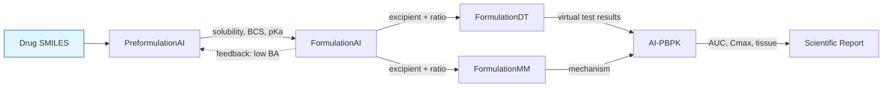

# The Ouyang Lab Computational Pharmaceutics Platforms — Scientific Summary

## Overview

Prof. Defang Ouyang's lab (Computational Pharmaceutical Group) at University of Macau has built a set of public-facing platforms covering different stages of drug formulation R&D. Each platform addresses one stage; together they form an end-to-end pipeline for computational pharmaceutics.

This document summarizes the **scientific** capabilities of each platform — what it predicts, what models it uses, what its current limitations are, and how it can be integrated into FormulationOS.

## Platform Comparison Table

| Platform | Purpose | Input | Output | Underlying Model | Current Limitation | Potential Integration |
|---|---|---|---|---|---|---|
| **PreformulationAI** (2025) | Pre-formulation property prediction for new molecular entities | Drug SMILES (single, multiple, or batch) | 5 modules: Fundamentals (12 descriptors — Density, MP, Tg, logP, logD, pKa, logS, kinetic solubility), Solubility (25–80 °C, organic solvents, binary systems), pH Profile (ionization-aware, pH 1–13), Developability (BCS, formulatability index), IF-Des descriptors (interpretable formulation descriptors) | PHARM-ML D-MPNN + TabPFN; trained on 700K samples | Standalone platform; results need manual transfer to FormulationAI; no programmatic API; batch mode exists but no streaming | **Stage 1 of workflow** — outputs (solubility, BCS, pKa) flow into FormulationAI as upstream inputs |
| **FormulationAI** (2024) | Excipient design across 6 formulation systems | Drug SMILES + per-system parameters (polymer choice, drug-polymer ratio, dosage form, etc.) | 16 properties: cyclodextrin complexation ΔG, solid-dispersion stability (3-/6-month), phospholipid complexation rate, nanocrystal size + PDI (3 methods), SEDDS self-emulsion status, liposome encapsulation/PDI/size/zeta potential | Multiple per-property ML models trained on 10+ years of curated data; pairwise descriptors for drug-excipient pairs | Each property requires separate web submission; no programmatic API; cross-system workflow requires manual re-entry | **Stage 2 of workflow** — receives PreformulationAI properties, outputs excipient set + ratio + process parameters |
| **FormulationMM** (2025) | Molecular modeling of drug-excipient systems | Drug + excipient structures (SMILES, .mol, .mol2, .xyz, .pdb, .cif, .gro) | Molecular Dynamics Simulation: topology, structure, settings files; binding free energies; interaction analysis | Physics-based: GAFF/GAFF2 forcefields, RESP/AM1-BCC charges, classical MD (all-atom or coarse-grained); automated parameter generation (MolParaGen) | Heavy compute (cloud HPC required); no standard output format for downstream integration; output is multi-file (topology + trajectory + analysis) | **Stage 4 of workflow** — provides mechanistic explanation (why a formulation is stable, why an API crystallizes) |
| **FormulationDT** (2024) | Digital twin — virtual formulation testing via ML; 12 decision recommendations | Drug + excipient + formulation parameters (from FormulationAI) | 12 decisions (oral + injectable); dissolution profile predictions; stability probabilities; formulatability index | PU-Decide framework + ensemble (DT, KNN, LR, LightGBM, NN, RF, SVM, nBayes); trained on approved drug formulations; ROC_AUC 0.78–0.98 | Each decision requires separate query; no integrated "given a drug, what 12 decisions does it imply?" | **Stage 3 of workflow** — receives formulation from FormulationAI, returns virtual test results + 12 strategic decisions |
| **AI-PBPK** (2025) | In-vivo drug fate and tissue distribution prediction | Drug SMILES + dose + dose_unit (g) + route (IV/oral) + simulation_time + time_unit (min) | Plasma PK curves; tissue distribution (15 organs: heart, kidney, lung, brain, liver, spleen, pancreas, stomach, gut, thymus, bone, skin, muscle, fat, blood cell); AUC; Cmax; Clearance; Bioavailability | 8 AI models (LogS, acid pKa, base pKa, crystal density via MPNN, IDR, LogPapp, Fu, CLbw, Kpu×15) feeding a SimBiology-derived PBPK model in Python; validated against PK-DB (71 IV + 606 oral human administrations); AUC predictions within 2-3× fold error | Auth-gated Streamlit app; no public API; PBPK model in Supplementary Material S1 (not full source); each query requires manual submission | **Stage 5 of workflow** — final validation; allows cross-formulation comparison (A vs B bioavailability) before in-vivo experiments |

## Information Flow Diagram

**Key principle:** the pipeline is **not hardcoded**. Branches and loops are first-class. A low-AI-PBPK-predicted bioavailability can return to FormulationAI for a different excipient set. A negative FormulationMM result can return to FormulationAI to reformulate.

## Cross-Platform Integration Points

| From → To | Information passed | Format |
|---|---|---|
| PreformulationAI → FormulationAI | Drug SMILES + solubility + BCS + pKa + LogP | JSON or dict |
| FormulationAI → FormulationDT | Drug + excipient + ratio | JSON or dict |
| FormulationAI → FormulationMM | Drug + excipient structures | SMILES or mol file |
| FormulationDT → AI-PBPK | Drug SMILES + dose + route (from scientist) | JSON or dict |
| FormulationMM → AI-PBPK | Drug SMILES (after mechanism check) | JSON or dict |
| Any stage → Any earlier stage | Feedback (e.g., "low bioavailability") | Natural language query |

## Licensing and Access

| Platform | License | Public Access |
|---|---|---|
| FormulationAI | CC BY 4.0 (Open Access) | Free, registration optional |
| PreformulationAI | (not yet known) | Free |
| FormulationMM | (per Zenodo data) | Free |
| FormulationDT | MIT (model code on GitHub: `NamanWang/FormulationDT`) | Code: free; platform: free, registration |
| AI-PBPK | (CPT 2025 paper) | Auth-gated Streamlit app; account required |

## Open Implementation Details

- **FormulationDT** has the most complete open implementation: MIT-licensed Python/Jupyter code on GitHub.
- **FormulationAI** is Open Access (CC BY 4.0) — paper is free; web platform requires optional registration.
- **FormulationMM** deposits simulation datasets on Zenodo; the underlying simulation code is referenced but not all released.
- **AI-PBPK** has the PBPK model in Supplementary Material S1 (Python, adapted from SimBiology).
- **PreformulationAI** is the newest (2025); paper not yet identified in this summary.

## References

1. Dong et al. (2024). "FormulationAI: a novel web-based platform for drug formulation design driven by artificial intelligence." *Briefings in Bioinformatics* 25(1):bbad419. DOI: 10.1093/bib/bbad419.
2. Wang et al. (2024/2025). "AI-directed formulation strategy design initiates rational drug development." *Journal of Controlled Release* 378:619–636. DOI: 10.1016/j.jconrel.2024.12.043.
3. Zhang et al. (2025). "FormulationMM: A universal computer-driven drug formulation platform." *Journal of Controlled Release* 387:114237. DOI: 10.1016/j.jconrel.2025.114237.
4. Wang et al. (2025). "An Integrated AI-PBPK Platform for Predicting Drug In Vivo Fate and Tissue Distribution in Human and Inter-Species Extrapolation." *Clinical Pharmacology & Therapeutics* 118(4):865–. DOI: 10.1002/cpt.3732.
5. PreformulationAI (2025). https://preformulationai.computpharm.org/. Platform live; paper not yet identified.
