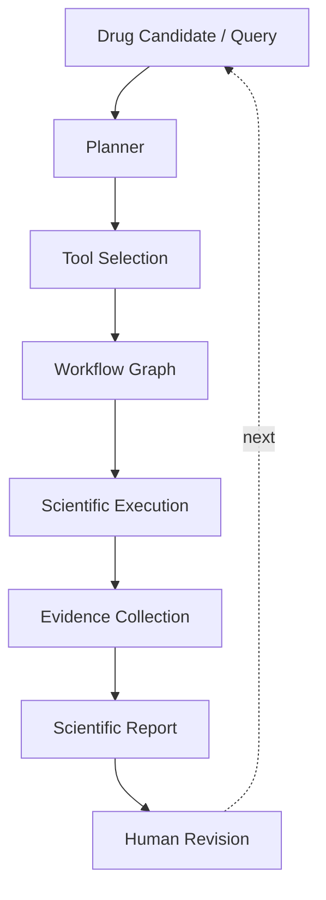
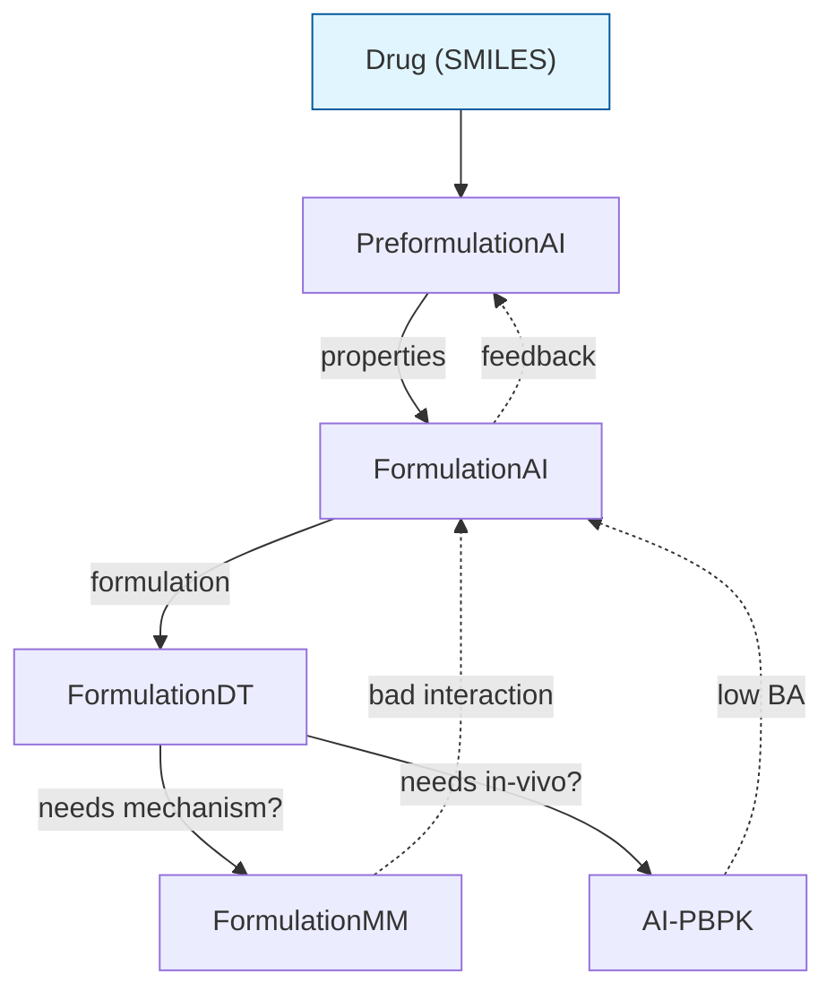

# FormulationOS — Research Plan

> A Scientific Operating Layer for Computational Pharmaceutics.
>
> *FormulationOS is not a new AI model. It organizes multiple scientific foundation models into reproducible scientific workflows.*

## 1. Motivation

### 1.1 The R&D Pipeline Reality

Drug formulation is intrinsically multi-stage:

1. **Pre-formulation characterization** — does this molecule have a chance?
2. **Formulation design** — what excipients, what ratio, what process?
3. **Virtual testing** — does it dissolve as predicted? Is it stable?
4. **Mechanistic understanding** — why does it work (or fail)?
5. **In-vivo prediction** — what happens in the human body?

Each stage has its own scientific model, its own data, its own domain experts. No single model covers the whole pipeline. Each lab builds stage-specific tools.

### 1.2 The Isolation Problem

Prof. Ouyang's lab at University of Macau has built at least five public platforms — FormulationAI, PreformulationAI, FormulationMM, FormulationDT, AI-PBPK — each addressing one stage of the pipeline. Similar fragmentation exists across the field (AlphaFold, ESM, AtomGPT, MDAnalysis, etc.).

Today, a scientist must:

1. Open a web platform for stage 1, type in a SMILES, get properties
2. Manually copy the output into stage 2's form
3. Repeat for stages 3, 4, 5
4. Integrate results in their head (or a Word document)
5. If a stage fails, start over

This is slow, error-prone, and produces no traceable evidence. The scientific record is lost between stages.

### 1.3 Why Now

Three trends converge:

- **LLM tool-use reached production quality.** GPT-4-class models reliably plan multi-step tool sequences.
- **Tool-specification standards matured.** OpenAPI, MCP, and emerging scientific extensions make tools composable in principle.
- **Reproducibility became regulatory-relevant.** FDA, EMA, and ICH increasingly demand traceable evidence chains.

The infrastructure for scientific workflow orchestration exists. No domain-specific platform has claimed it.

### 1.4 What FormulationOS Is Not

- ❌ **Not a new AI model.** We do not train or publish a new formulation predictor.
- ❌ **Not a chat agent.** We do not optimize for chat-style task completion.
- ❌ **Not an OS in the Linux sense.** We use the OS metaphor for the operating-layer abstraction; we are not a kernel, scheduler, or filesystem.
- ✅ **A Scientific Operating Layer** — composes existing scientific foundation models into reproducible, traceable, replayable scientific workflows.

## 2. The Scientific Workflow Abstraction

### 2.1 Single Workflow Iteration

**Each step:**

- **Drug Candidate / Query** — natural-language input (e.g., "design an oral tablet for ibuprofen at 200 mg")
- **Planner** — LLM or rule-based, decides which tools to call
- **Tool Selection** — concrete tool instances picked from the registry
- **Workflow Graph** — DAG of tool invocations with scientific-dependency edges
- **Scientific Execution** — actual model invocation (real backend or mock)
- **Evidence Collection** — provenance records: inputs, outputs, hashes, compute env
- **Scientific Report** — Markdown artifact combining all results
- **Human Revision** — scientist reviews; may revise query, re-run, or accept
- **Next Workflow** — trigger a new workflow (e.g., validate findings, try variant)

### 2.2 Six Properties a Scientific Workflow Must Have

| Property | Definition | Why |
|---|---|---|
| **Executable** | Can be invoked by the Runtime to produce results. | Workflows are operational, not just diagrams. |
| **Persistent** | Can be stored and reloaded across sessions. | The scientist's work must survive breaks. |
| **Replayable** | Can be re-executed in full or incrementally. | Bug fixes, retraining, re-validation. |
| **Refinable** | Can be modified (add/remove/change nodes) and re-run with affected nodes only. | Iterative science. |
| **Provenance-aware** | Every execution produces a reproducible evidence chain. | Regulatory + scientific reproducibility. |
| **Artifact-centric** | Outputs are scientific artifacts (Markdown, JSON, CSV, figures), not chat replies. | Easy to cite, share, audit. |

### 2.3 Why a New Abstraction (not "just a DAG")

A DAG is a data structure. A Scientific Workflow is a **first-class operating-system object** with state, identity, persistence, lifecycle, and a contract. The DAG is the **internal representation** of the workflow's execution plan, not the abstraction itself.

Future implementations may represent workflows as graphs with branches, loops, agent iterations, or multi-turn refinement — without changing the abstraction surface.

## 3. The Ouyang Lab Toolchain (Scientific View)

See [`ouyang_platforms_summary.md`](ouyang_platforms_summary.md) for the full 5-platform comparison.

### 3.1 The Five Platforms as One Pipeline

**Key insight:** the workflow is **not a hardcoded linear pipeline**. Branches and short-circuits are first-class. If solubility is very low, the workflow can loop back to reformulate. If PK predicts low bioavailability, it can return to FormulationAI for a different excipient set.

## 4. Research Directions

We identify three research directions, ordered by stability vs. ambition.

### 4.1 Direction 1: Scientific Workflow OS (most stable)

**Scientific Question:** Can a workflow abstraction serve as the fundamental operating unit for scientific computation, parallel to OS processes in Linux?

**Novelty:**

- First-class workflow objects with persistence / replay / refinement / provenance
- Scientific Tool Specification (STS) as an extension schema over OpenAPI/MCP
- Deterministic-evidence (not deterministic-model) guarantee
- Domain-agnostic architecture, instantiated in pharmaceutics

**Technical Challenges:**

- DAG vs richer execution models (loops, branches, agent iteration)
- Cross-tool data-format translation
- Provenance capture without coupling to tool internals
- Application-domain analysis (is this prediction reliable for my input?)

**Potential Venues:** MLSys, OSDI, EuroSys, AAAI (AI for Science track), ASPLOS

**Potential Experiments:**

- 5-platform integration: end-to-end workflow for "design ibuprofen tablet + validate PK"
- Replay demo: change one node, observe only affected nodes re-execute
- Provenance case study: trace an artifact back to all upstream inputs and tool versions
- Cross-domain portability: instantiate on materials / protein / climate with the same architecture

**Potential Risks:**

- Reviewer: "Just a DAG with provenance." Counter: 6 properties exceed DAG semantics; abstraction-vs-representation separation in §2.3.
- Maturity bar: Ouyang's platforms (maturity bar in [`maturity/ouyang_platforms.md`](maturity/ouyang_platforms.md)) are the reference; we must integrate at least 3 real platforms to claim "real tool integration."
- Comparability: Workflows are domain-specific; general benchmarks (e.g., DAG execution latency) may not capture value.

### 4.2 Direction 2: LLM Planning for Pharmaceutical Foundation Models (agent direction)

**Scientific Question:** Can LLMs reliably plan multi-step pharmaceutical workflows from natural language, given a registry of scientific tools with structured metadata?

**Novelty:**

- Domain-specific planning evaluation in a real vertical (not synthetic)
- Tool retrieval + scientific-dependency-aware planning (vs flat function calling)
- Comparison with general-purpose agents (LangGraph, AutoGen, OpenManus, Claude Code)
- Failure mode analysis in a high-stakes domain

**Technical Challenges:**

- Tool retrieval at scale (5 → 50 → 500 tools); embedding vs LLM-based
- Constraint satisfaction (scientific dependencies must be respected)
- Hallucination of tool names; calibration of planner confidence
- Cost vs quality trade-off (multi-LLM routing)

**Potential Venues:** NeurIPS, ICLR, ICML, KDD (AI for Science track), IUI

**Potential Experiments:**

- Planner accuracy benchmark: 200 NL queries → golden Workflow DAG (NDCG, exact-match, node-F1)
- Tool-retrieval ablation: embedding vs LLM-ranked vs random
- Constraint-violation rate: how often does the planner produce a scientifically invalid workflow?
- Cost-quality frontier: planner accuracy as a function of LLM call count

**Potential Risks:**

- LLM planners are commodities; reviewers may see this as "wrapping GPT-4 in a domain prompt"
- Benchmarks (PLANNER-200) may not capture real R&D complexity; expert evaluation needed
- Hallucination of tool names is a known issue; we need careful evaluation

### 4.3 Direction 3: Scientific Workflow Optimization (learning workflow)

**Scientific Question:** Can we learn optimal workflow policies from execution traces to improve future planning — lower cost, higher quality, fewer human interventions?

**Novelty:**

- Meta-learning over scientific workflows (not just RLHF on chat)
- Provenance as supervision signal (each execution produces a (query, workflow, evidence, human-accept) tuple)
- Cost-aware planning beyond just latency (incorporate tool cost metadata)
- Workflow portfolio optimization: which combination of tools gives best AUC per dollar?

**Technical Challenges:**

- Sparse rewards: most workflow runs succeed or fail qualitatively
- Offline RL with provenance traces; counterfactual reasoning
- Combinatorial action space (which subset of 5–500 tools, in which order)
- Generalization across domains (training on pharmaceutics, evaluating on materials)

**Potential Venues:** ICML, ICLR, AISTATS, NeurIPS (Meta-Learning workshop), RL Conference

**Potential Experiments:**

- Cost reduction: same quality, 30% fewer tool calls vs unoptimized planner
- Cross-formulation comparison: portfolio of tools vs best single tool
- Provenance replay: re-run workflows from trace with retrained planner, measure human-acceptance rate
- Online learning: planner improves over time as scientists use it

**Potential Risks:**

- Requires real execution data at scale (cold start problem; we have v0.1 mock execution only)
- May not generalize across domains (a workflow optimizer for pharmaceutics may fail on protein)
- Evaluation is hard: workflow quality is multi-dimensional (accuracy, cost, time, user satisfaction)

### 4.4 Comparison

| | Direction 1 (Workflow OS) | Direction 2 (LLM Planning) | Direction 3 (Learning Workflow) |
|---|---|---|---|
| Stability | High (system paper) | Medium (LLM evaluation) | Low (research-heavy) |
| Novelty | Architecture + design | Empirical comparison | Methodology |
| Venue | MLSys, OSDI, AAAI | NeurIPS, ICML, KDD | ICML, ICLR |
| Data needed | None beyond mock + 1 real | Workflow corpus | Execution traces |
| Timeline to first paper | 3-4 months | 4-6 months | 6-12 months |
| Risk | Reviewer skepticism | Benchmark validity | Cold start |

## 5. Reference Architecture

For the five-layer architecture and STS v0.2, see:

- [`architecture.md`](architecture.md) — five layers + query flow
- [`sts_specification.md`](sts_specification.md) — Scientific Tool Specification

## 6. Pointers

- Maturity bar: [`maturity/ouyang_platforms.md`](maturity/ouyang_platforms.md)
- Ouyang platforms summary: [`ouyang_platforms_summary.md`](ouyang_platforms_summary.md)
- Defensive discussion: [`discussion.md`](discussion.md)
- Paper outline: `../paper/outline.md`
