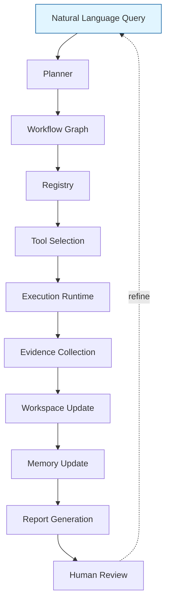

# FormulationOS — System Design

> An operating-system view of FormulationOS: how the whole thing works internally, from a natural-language query to a reproducible scientific report.

## 1. Motivation

### 1.1 Why not just an Agent?

| Agent frameworks | FormulationOS |
|---|---|
| Optimize for chat-style task completion | Optimize for reproducible scientific evidence |
| Output: "task done" message | Output: Markdown report + provenance chain |
| LLM calls vary across runs | Same Workflow DAG → same evidence (models may vary) |
| Browser automation (OpenManus) or code (Claude Code) | Programmatic tool invocation via STS v0.2 |
| No formal contract for tool inputs/outputs | STS v0.2 declarative schema |
| No scientific-dependency enforcement | Scientific dependencies expressed in STS, validated by Scientific Dependency Enforcer |
| Multi-agent conversation, not always reproducible | Deterministic-evidence guarantee |

**The fundamental difference:** agents optimize for *task completion*; FormulationOS optimizes for *reproducible scientific evidence*. The output is not a chat reply — it is a Markdown report that an FDA reviewer could inspect.

### 1.2 Why not just MCP?

MCP (Model Context Protocol) is a **protocol for tool discovery and invocation**, not a workflow orchestrator. FormulationOS uses MCP as a substrate and adds:

- **Scientific-Tool Specification (STS) v0.2** — extension schema over OpenAPI/MCP with 4 scientific extensions
- **Scientific Workflow Abstraction** — first-class workflow objects with state, identity, lifecycle
- **Scientific Dependency Enforcer** — validates that Workflow DAGs respect scientific constraints
- **Planner** — LLM/RB planner that composes workflows from natural language
- **Workspace + Memory** — persistent state across sessions
- **Evidence + Provenance** — deterministic-evidence chain per execution
- **Report generator** — human-readable artifact combining all results

Without FormulationOS, MCP gives you tools. With FormulationOS, you have a scientific operating layer above MCP that makes those tools composable into reproducible workflows.

### 1.3 Why not just a Workflow System (Airflow / Prefect)?

General-purpose workflow systems optimize for **data-pipeline orchestration**: ETL jobs, scheduled tasks, container orchestration. They have no concept of:

- Scientific semantics (capability annotations, planning hints)
- Scientific dependencies (this tool requires upstream X)
- Evidence chain (what was run, with what inputs, producing what outputs)
- Reproducibility (regulatory requirement)
- Artifact-centric output (Markdown, JSON, CSV — not "task done")

FormulationOS is a **domain-specialized** workflow system for scientific workflows, analogous to Galaxy (for genomics).

### 1.4 Why Scientific Workflow (not generic Workflow)?

A Scientific Workflow has 6 specific properties (per `paper/sections/03_scientific_workflow_abstraction.md`):

1. **Executable** — can be invoked by the Runtime to produce results
2. **Persistent** — can be stored and reloaded across sessions
3. **Replayable** — can be re-executed in full or incrementally
4. **Refinable** — can be modified and re-run with affected nodes only
5. **Provenance-aware** — every execution produces a reproducible evidence chain
6. **Artifact-centric** — outputs are scientific artifacts, not chat replies

These 6 properties are non-negotiable for scientific use. A generic workflow abstraction can be specialized into a scientific one; a scientific one cannot be reduced to a generic one without losing value.

## 2. Design Principles

| Principle | What it means |
|---|---|
| **Tool-independent** | The system is not tied to any specific tool. New tools are added by writing one YAML file (STS v0.2). |
| **Model-independent** | The system is not tied to any specific AI model. The Planner can be rule-based or LLM-based; both are first-class. |
| **Workflow-first** | The Workflow is the first-class object. Everything else (Planner, Registry, Execution) is a service to the Workflow. |
| **Evidence-first** | Every execution produces evidence. Evidence is not optional; it is the system's primary output. |
| **Human-in-the-loop** | The scientist is part of the loop. Workflows are reviewed, refined, and re-run. The system does not claim autonomous operation. |
| **Reproducibility over cleverness** | Same Workflow DAG + same tool versions + same compute env → same evidence chain. Models may vary; evidence does not. |
| **Adapter, not vendor** | Third-party code (e.g., FormulationDT's MIT-licensed code) is integrated via Adapter pattern, not vendored. Adapters can be updated without changing FormulationOS. |
| **MCP-compatible** | We use MCP as a substrate where possible. STS v0.2 can be generated from MCP tool descriptors. |
| **Domain-specialized, architecture-agnostic** | The architecture is domain-agnostic; the validation is in pharmaceutics. |

## 3. End-to-End Pipeline



**Each stage:**

| Stage | Responsibility | Implementation |
|---|---|---|
| Natural Language Query | User input | Streamlit text area, REST POST, CLI |
| Planner | Decide which tools to call in which order | RuleBased (default) or LLM (opt-in) |
| Workflow Graph | DAG of tool invocations with dependencies | Dataclass-based; serialized to JSON |
| Registry | Resolve tool names to Tool instances | YAML-based STS v0.2 loader |
| Tool Selection | Pick specific tool versions + executors | Filtered registry query |
| Execution Runtime | Run tools, handle errors, parallelize independent branches | Python executor (others planned) |
| Evidence Collection | Capture inputs, outputs, hashes, compute env, timestamps | Provenance record per node |
| Workspace Update | Persist Workflow + artifacts to disk | Local FS (Phase 2: real Workspace) |
| Memory Update | Append session log | docs/memory/YYYY-MM-DD.md |
| Report Generation | Combine results into Markdown | Jinja-style template |
| Human Review | Scientist evaluates; may refine query | UI button: "Refine" |

The loop closes: human review can trigger a new query (e.g., "What if we used a different excipient?"), which generates a refined Workflow. Only the affected nodes re-execute (see Workflow refinement property in §5.2).

## 4. Core Components

### 4.1 Planner

**Role:** Decides which tools to call in which order, given a natural-language query and a registry of available tools.

**Implementations:**

- **RuleBasedPlanner (default):** Token + capability matching; deterministic; fast; no API key.
- **LLMPlanner (opt-in):** Uses an LLM (MiniMax M3 by default, OpenAI optional) with structured output. Lazy-imported.

**Inputs:**

- Query (string)
- Registry (list of ToolSpec)

**Outputs:**

- Workflow (DAG of nodes; each node references a Tool + arguments)

**Constraints:**

- Workflow must respect scientific dependencies (validated by Scientific Dependency Enforcer before execution)
- Workflow must be acyclic (DAG, not graph with cycles) in v0.1; future may add cycles for agent iteration

**Location:** `src/formulation_os/planner/{base.py, rule_based.py, llm.py}`

### 4.2 Registry

**Role:** Resolves tool names to Tool instances. The single source of truth for "what tools exist."

**Implementation:**

- Built-in tools: `src/formulation_os/tools/builtins/*/tool.yaml` (STS v0.2)
- External tools (Phase 2+): `src/formulation_os/tools/builtins/<external_name>/tool.yaml`
- Loading: `src/formulation_os/tools/loader.py`

**Each tool has:**

- `name`, `version`, `owner`, `description`
- `input_schema`, `output_schema` (JSON Schema)
- `semantics`: capabilities + domain
- `planning_hints`: examples, keywords, notes
- `scientific_dependencies`: optional + required upstream capabilities
- `executor`: type + module/function or URL/command
- `provenance_spec`: what to record
- `cite`: paper, DOI, license (NEW in v0.2)

**Caching:** Loaded once per session; immutable thereafter.

### 4.3 Executor

**Role:** Run a single tool invocation, handle errors, capture provenance.

**Implementations (v0.1):**

- **PythonExecutor** — in-process Python function call

**Planned (Phase 2+):**

- **HTTPExecutor** — REST API call (for FormulationAI / PreformulationAI / AI-PBPK web platforms)
- **CLIExecutor** — subprocess call
- **MCPExecutor** — Model Context Protocol server
- **DockerExecutor** — containerized tool
- **gRPCExecutor** — gRPC service

**Output:** A `ToolResult` with:

- `tool_name`, `tool_version`
- `input`, `output`
- `status`: ok | error
- `error`: error message if any
- `duration_ms`
- `warnings`: list of strings

### 4.4 Workspace

**Role:** Persistent state across sessions.

**v0.1:** Stub (`src/formulation_os/workspace/__init__.py`); full implementation deferred to Phase 2.

**Phase 2 design:**

- Workflows: stored as JSON files in `~/.formulation_os/workflows/`
- Artifacts: stored alongside (or referenced by path)
- Provenance: stored as Parquet or JSONL
- Replay: load workflow → re-execute → compare evidence

**Interaction:** Workspace is updated by Execution Runtime after each node completes.

### 4.5 Memory

**Role:** Append-only session log for human review.

**Implementation:** Markdown files in `docs/memory/YYYY-MM-DD.md` (project-level), one file per day, sections: What was done / What was decided / What's next.

**Convention:** Written after each session, before saying goodbye. Cross-references to the latest memory file are part of the system flexibility statement (`AGENTS.md` §3).

**Why not a database?** Markdown is human-readable, git-versioned, and survives the project. Future tooling can index it.

### 4.6 Evidence & Provenance

**Role:** Capture the evidence chain for every execution. The "deterministic evidence" guarantee.

**What is recorded per node:**

- `execution_id`, `workflow_id`, `node_id`
- `tool_name`, `tool_version`, `tool_spec_hash`
- `input_hash` (sha256 of input)
- `output_hash` (sha256 of output)
- `executor_type`, `executor_config_hash`
- `started_at`, `finished_at`, `duration_ms`
- `status`
- `compute_env`: Python version, platform, seed

**What this gives us:**

- **Reproducibility:** same workflow + same tool versions + same env → same hashes
- **Trace-back:** from any artifact to all upstream inputs
- **Audit:** an FDA reviewer can reconstruct the exact computation
- **Citation:** the tool's paper/DOI is recorded in the `cite:` field

**Implementation:** JSON format, written to disk per execution; future may use Parquet for scale.

### 4.7 Report Generator

**Role:** Combine tool results into a human-readable Markdown report.

**Output format:**

- Header: query, timestamp, status
- Per-tool section: status pill, duration, warnings, input/output JSON
- Footer: provenance metadata (tool versions, hashes, env)

**Used by:**

- Streamlit UI (renders the report inline)
- API responses (JSON + Markdown)
- Paper (Appendix figures can be generated from reports)

**Implementation:** `src/formulation_os/report/report.py` (dataclass + Jinja-style template)

## 5. Scientific Workflow Abstraction

### 5.1 Internal Representation: DAG

A Scientific Workflow is internally represented as a **directed acyclic graph (DAG)**:

```python
@dataclass
class WorkflowNode:
    node_id: str
    tool: Tool  # resolved from Registry
    arguments: dict[str, Any]
    depends_on: list[str]  # node_ids this node waits for

@dataclass
class Workflow:
    workflow_id: str
    query: str
    nodes: list[WorkflowNode]
    edges: list[tuple[str, str]]  # (from_node_id, to_node_id)
    metadata: dict[str, Any]
```

### 5.2 The 6 Properties (revisited)

| Property | Implementation |
|---|---|
| Executable | `Workflow.run(registry, executor) -> Report` |
| Persistent | `Workflow.to_json()` / `Workflow.from_json()` |
| Replayable | `Workflow.run(registry, executor, replay_from=node_id)` |
| Refinable | `Workflow.replace_node(node_id, new_node)` |
| Provenance-aware | `ProvenanceRecord` per node; `Workflow.provenance()` |
| Artifact-centric | `Workflow.artifacts()` returns list of artifact paths |

### 5.3 Why DAG (and why not "just a DAG")

DAG is the current internal representation. The **abstraction** is the Scientific Workflow with 6 properties. Future implementations may extend to:

- Graphs with branches (if-then-else)
- Loops (until convergence)
- Agent iterations (multi-turn refinement)

These extensions do not change the abstraction surface (the 6 properties remain); they change the internal representation.

## 6. Extension Mechanism

### 6.1 Adding a New Tool

Two options:

**Option A: STS YAML (recommended for most tools)**

```bash
mkdir -p src/formulation_os/tools/builtins/<tool_name>/
```

Create three files:

1. `tool.yaml` — STS v0.2 declaration (semantics, schemas, executor, cite)
2. `backend.py` — `def run(input: dict) -> dict`
3. `README.md` — human-readable docs, citation, license

**Option B: Adapter pattern (recommended for 3rd-party code)**

```bash
mkdir -p src/formulation_os/tools/builtins/<tool_name>/
```

Same three files, but `backend.py` wraps an `adapter.py` that lazy-imports the 3rd-party library:

```python
# adapter.py
class FormulationDTAdapter:
    def __init__(self):
        from formulation_dt import predict_decision_1, ...
        self.predictors = [...]

    def predict_all_decisions(self, smiles: str) -> dict:
        ...

# backend.py
from .adapter import FormulationDTAdapter
_adapter = FormulationDTAdapter()

def run(input_data: dict) -> dict:
    return _adapter.predict_all_decisions(input_data["drug_smiles"])
```

**Why Adapter, not Vendor:** Vendor copies the 3rd-party repo into our tree. Adapter imports it via `pip install`. Adapters can be updated without changing FormulationOS.

### 6.2 Adding a New Executor

```python
# src/formulation_os/runtime/executor.py
class HTTPExecutor(Executor):
    """Executor for REST API tools."""

    def execute(self, tool: Tool, arguments: dict) -> ToolResult:
        # 1. POST to tool.endpoint
        # 2. Capture response + provenance
        # 3. Return ToolResult
```

Add to Executor type registry. Update `tools/loader.py` to recognize `executor.type: http`.

### 6.3 Adding a New Planner

```python
# src/formulation_os/planner/llm.py  (existing) or new file
class MyNewPlanner(Planner):
    def plan(self, query: str, registry: Registry) -> Workflow:
        # ... your planning logic
        return Workflow(...)
```

Wire up via `LLM_PLANNER=1` env var or `--planner=my_new` CLI flag.

### 6.4 Adding a New Domain

The architecture is domain-agnostic. To add materials science:

1. Define new capability tags (e.g., `band_gap`, `formation_energy`)
2. Add tools for materials science platforms
3. Add domain-specific dependencies
4. Validate against a materials-specific benchmark

No changes to Planner, Registry, Executor, Workspace, or Report.

## 7. Future Evolution

### 7.1 Near-term (Phase 2)

- Real tool integration: 3 of 5 Ouyang platforms wrapped as Adapters
- Workspace: full implementation
- Provenance: Parquet output for scale
- Cost metadata: in workflow planning decisions

### 7.2 Medium-term (Phase 3-4)

- Real FormulationAI integration
- PreformulationAI integration
- FormulationMM integration
- Workflow refinement UI (Streamlit)

### 7.3 Long-term

- Multi-agent workflows (loops, agent iterations)
- Cross-domain portability (materials, protein, climate)
- Workflow optimization via offline RL on provenance traces
- Integration with cloud HPC for heavy compute (FormulationMM)

## 8. Pointers

- [`architecture.md`](architecture.md) — five layers + query flow
- [`sts_specification.md`](sts_specification.md) — Scientific Tool Specification v0.2
- [`tool_author_guide.md`](tool_author_guide.md) — how to add a new tool
- [`research_plan.md`](research_plan.md) — research direction context
- [`../paper/sections/03_scientific_workflow_abstraction.md`](../paper/sections/03_scientific_workflow_abstraction.md) — formal Workflow definition
